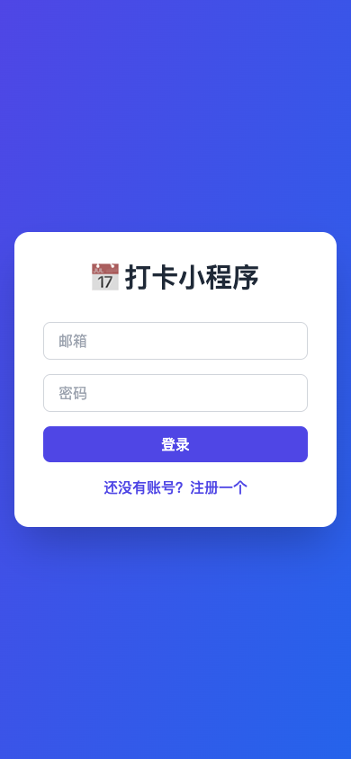
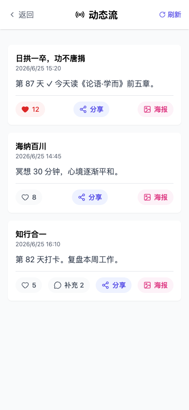
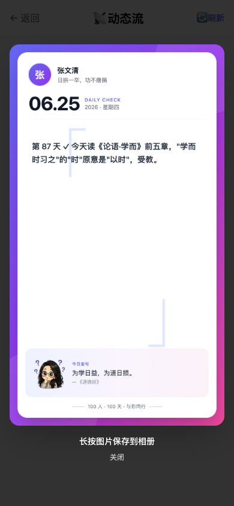
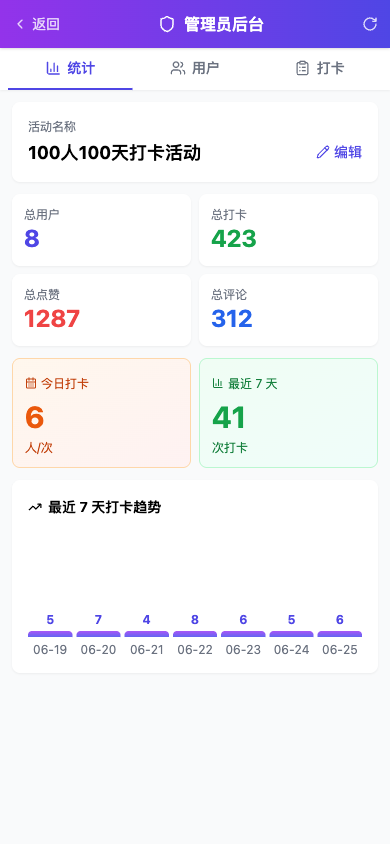

# 100 人 100 天打卡

为马来西亚 WhatsApp 社群打造的中文集体打卡 PWA — 一日一卡，百日同行。

**[👉 Live Demo](https://punch-card-ruddy.vercel.app)**

---

## 📸 截图

| 登录 | 首页 |
|---|---|
|  |  |

| 动态流 | 一键生成海报 |
|---|---|
|  |  |

**管理员后台**

---

## ✨ 主要功能

- 每日文字 / 图片（10 张）/ 视频（30 秒）/ 语音打卡
- 朋友圈式打卡墙 + 点赞 / 评论 / 举报
- 100 条文言金句 + 卡通 Mascot 每日陪伴
- 一键生成 4:5 分享海报，原生分享到 WhatsApp Status
- 个人目标进度 + 连击成就（7 / 30 / 100 天）
- 排行榜 / 动态流 / 私密打卡墙切换
- 管理员后台：内容审核（隐藏 / 删除 / 冻结）+ 操作日志
- 密码自助重置 + 数据导出 Markdown
- PWA：装到主屏，离线壳，Web 通知

## 🏗️ 技术栈

**前端** React 18 · Vite · TailwindCSS · lucide-react · vite-plugin-pwa
**后端** Supabase (Auth + Postgres + Storage + RLS + Edge Views)
**部署** Vercel

## 📄 隐私

- 用户数据存储在 Supabase（新加坡 / 美国区域），通过 Row-Level Security 隔离
- 不收集地理位置 / 设备 ID / 浏览历史
- 不出售数据给第三方
- 详见 [隐私政策](https://punch-card-ruddy.vercel.app/privacy) 和 [服务条款](https://punch-card-ruddy.vercel.app/terms)

## 🛠️ 构建

独立开发 · Built with [Claude Code](https://claude.com/claude-code)

---

*本项目不接受外部贡献；如有问题或建议，请通过活动 WhatsApp 群联系。*
